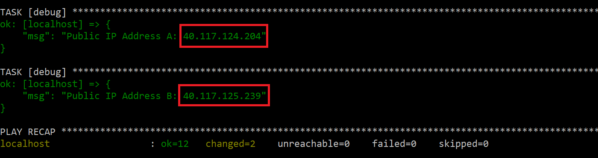
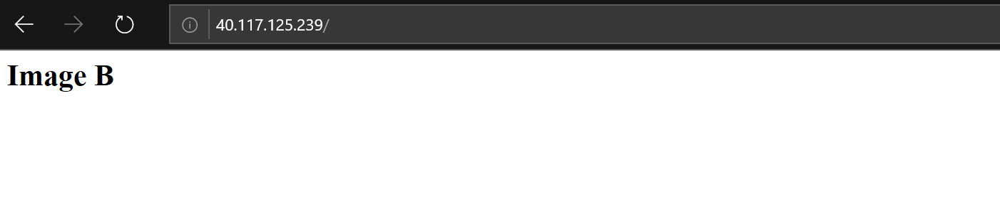
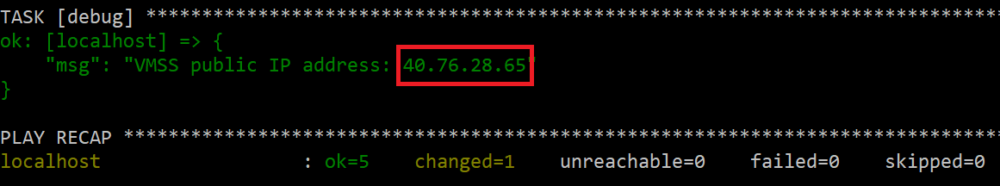
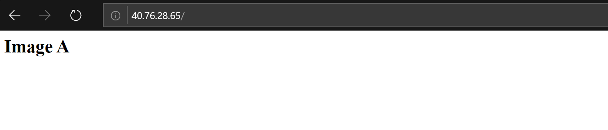
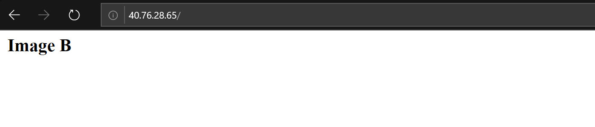

# Working with VMSS and Custom Images


## Step One - Create two virtual machines and install HTTPD

Run following playbook:

```
ansible-playbook 01-create-vms.yml --extra-vars "resource_group=myrg"
```

It will:
- create 2 virtual machines
- install HTTPD on both of them
- change index.html to contain **Image A** and **Image B** respectively

Copy and paste IP addresses of both VMs to the browser:




You should see two different versions of VM:


and




## Step Two - Capture Images from both Virtual Machines

Run second playbook to capture the images:

```
ansible-playbook 02-capture-images.yml --extra-vars "resource_group=myrg"
```

## Step Three - Create VMSS using Image A

In this step we will create following components:
- public IP address
- load balancer
- VMSS referring image A

Run following playbook:

```
ansible-playbook 03-create-vmss.yml --extra-vars "resource_group=myrg"
```

Check the IP address printed out at the end:



check that it works in the browser:



## Step Four - Update Image Reference in VMSS and Upgrade Instances

Run final playbook to replace image A with image B:

```
ansible-playbook 04-update-vmss-image.yml --extra-vars "resource_group=myrg"
```

Now press **F5** in the browser to reload page and see that image gas changed:




## Additional Documentation

https://docs.microsoft.com/en-us/azure/virtual-machine-scale-sets/virtual-machine-scale-sets-faq

https://clouddna.wordpress.com/2017/11/30/azure-virtual-machine-scale-set-with-custom-image/

Article on creating VMSS using Azure CLI:

https://docs.microsoft.com/en-us/azure/virtual-machine-scale-sets/tutorial-use-custom-image-cli

Updating applications on VMSS using Azure CLI:

https://docs.microsoft.com/en-us/azure/virtual-machine-scale-sets/tutorial-install-apps-cli


How to update VMSS image?

https://stackoverflow.com/questions/44582195/how-to-update-scale-set-image-vms

https://msftstack.wordpress.com/2016/05/17/how-to-upgrade-an-azure-vm-scale-set-without-shutting-it-down/

https://docs.microsoft.com/en-us/azure/virtual-machine-scale-sets/virtual-machine-scale-sets-upgrade-scale-set
